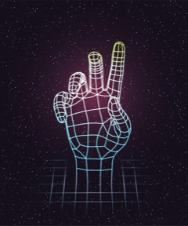
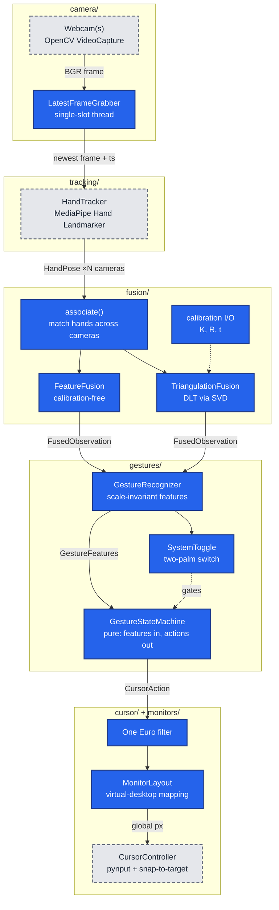

<div align="center">



# CamCursor

**Control your desktop cursor with hand gestures from a webcam.** A real-time
computer-vision pipeline from threaded capture to OS cursor, built as a
single-webcam MVP with a multi-camera 3D path already in place.

Python · MediaPipe · OpenCV · NumPy · pynput

[](../../actions/workflows/ci.yml)

</div>

> **About this repository.** This is a case study plus a runnable, hardware-free
> extract of the project's core logic (`handcursor_core/`). The full system is in a
> private repository; I'm happy to walk through it or grant read access during an
> interview.

---

## The problem

Pointing with a bare hand in front of a webcam sounds simple. In practice it runs
into four problems at once. OpenCV's capture buffer quietly adds latency. Landmark
noise makes the cursor jitter while you hold still, but smoothing it away makes the
cursor lag when you move fast. The fist and pinch poses look alike from one camera, so
a single misread frame can fire a click or drop a drag. And one camera has no real
depth. CamCursor handles each of these in its own pipeline stage. It maps an open palm
to cursor movement, a pinch to press/drag/release, a fist to freeze and two open palms
to an on/off switch, across every connected monitor.

| Gesture | State | Effect |
|---|---|---|
| Open hand | `MOVING` | Cursor follows the palm (smoothed) |
| Pinch (thumb + index) | `PINCH_CLICK` → `DRAGGING` | Button down; quick release = click. Held, it reads as `DRAGGING` (button stays down, cursor follows), even before the hand moves |
| Fist | `DISABLED` | Cursor freezes |
| No hand / bare point | `IDLE` | Nothing moves (bare point reserved for a precision mode) |
| Two open palms | system toggle | Turns the whole system on/off |

---

## Architecture (full system)

Data flows one way. Each stage consumes one typed contract and produces the next, so
any stage can be swapped without touching the others. Solid blue nodes are included
in this repo; grey dashed nodes are private.



The full design write-up, including the triangulation math, is in
**[ARCHITECTURE.md](ARCHITECTURE.md)**.

---

## Key technical decisions

### 1. One Euro filter instead of a moving average
A moving average or fixed EMA has one setting, so it is either smooth and laggy or
responsive and jittery. The One Euro filter (Casiez et al., CHI 2012) raises its
cutoff frequency with hand speed. It smooths heavily while you hold still on a target
and lightly while you sweep across monitors. It also works from real timestamps, so
it stays correct when MediaPipe inference time, and with it the frame rate,
fluctuates.
*Tradeoff:* it has two knobs (`min_cutoff`, `beta`) that need tuning per setup, and
at the start of a fast motion it still lags a little until the speed estimate catches
up. → [`handcursor_core/smoothing.py`](handcursor_core/smoothing.py)

### 2. A single-slot grabber thread instead of reading the capture buffer
If the pipeline reads more slowly than the camera delivers, `VideoCapture.read()`
returns older and older frames, and latency builds up without any visible sign. A
dedicated thread keeps overwriting one slot with the newest frame, so each iteration
works on the most recent image.
*Tradeoff:* the pipeline deliberately drops frames. That is right for a pointer and
wrong for anything that needs every frame, such as recording.
→ [`handcursor_core/camera/grabber.py`](handcursor_core/camera/grabber.py)

### 3. Hysteresis, debouncing and a sticky pinch, in a pure state machine
The pinch uses separate engage and release thresholds, which leaves a dead band where
nothing changes. A pinch must hold for N frames before it fires, and a fist must hold
for M frames before the cursor freezes. While the button is held, a one-frame "fist"
misread cannot break the drag. The drag ends only when the fingers clearly separate or
the supporting fingers stay curled for M frames. The state machine takes features in
and returns actions, and never touches the OS, so all of this is unit-tested with
synthetic features.
*Tradeoff:* debouncing adds a frame or two of latency to clicks. Pressing on the
rising edge of the pinch keeps that small, and one mechanism covers both click and
drag.
→ [`handcursor_core/gestures/state_machine.py`](handcursor_core/gestures/state_machine.py)

### 4. Movement on the open palm rather than a pointed finger
A face-on open palm is the pose MediaPipe tracks most reliably. Moving the cursor is
the most frequent action, so it goes on that pose. The fragile pinch/fist boundary is
then used only briefly, for discrete clicks.
*Tradeoff:* movement is less precise than tracking a fingertip, so a bare index point
is kept unmapped for a future precision mode.

### 5. The 3D path is built behind a passthrough
The fusion layer groups each hand across cameras and reconstructs all 21 landmarks in
metric 3D with an SVD-based DLT solve. It can drop views whose timestamps lag the
others. With one camera, it returns the single-camera result by construction, so the
MVP ships unchanged and the multi-camera upgrade needs no pipeline changes.
*Tradeoff:* triangulation needs a calibrated rig, so a calibration-free
feature-fusion strategy (per-camera features weighted by view quality) sits behind
the same interface.
→ [`handcursor_core/fusion/`](handcursor_core/fusion/)

---

## Numbers (verified)

| | Full private project (working tree, 2026-10-07) | This repo |
|---|---|---|
| Package code | 2,632 lines across 33 `.py` files (`handcursor/`) | 1,904 lines (`handcursor_core/`) |
| Tests | 85 hardware-free test functions, 1,785 lines | 91 tests (76 ported + 15 new), 1,844 lines |
| Hardware needed to run tests | none | none |

Counted with `find <pkg> -name '*.py' | xargs wc -l`, `grep -rE '^\s*def test_' tests | wc -l`
and `pytest --collect-only`. The 9 full-project tests not ported cover the private
cursor controller (relative clutch mode, snap-to-target) and the OpenCV multi-camera
source.

---

## What's in this repo vs. private

| Included here (runnable, tested) | Kept private |
|---|---|
| `gestures/`: recognizer, state machine, states, two-palm system toggle | `app.py`: the full real-time integration loop and debug HUD |
| `smoothing.py`: One Euro filter | `tracking/hand_tracker.py`: MediaPipe wiring |
| `monitors/layout.py`: virtual-desktop mapping | `cursor/controller.py`: pynput injection, relative clutch mode |
| `camera/grabber.py`: single-slot threaded grabber (source-agnostic) | `targets/snap.py`: magnetic snap-to-target via the macOS Accessibility API |
| `fusion/`: association, feature fusion, DLT triangulation, calibration I/O | Tuned thresholds (`config.yaml`) and real camera calibration |
| `tracking/types.py`: `HandPose`, `GestureFeatures`, landmark topology | Calibration and camera tooling scripts |

**Toy stand-ins, clearly labelled, behind the same interfaces:**

- [`tracking/synthetic.py`](handcursor_core/tracking/synthetic.py) builds hand-made
  21-landmark skeletons (open, pinch, fist) in place of MediaPipe and emits the same
  `HandPose` type.
- [`cursor/sink.py`](handcursor_core/cursor/sink.py) applies One Euro smoothing and
  monitor mapping, then *records* press/release events instead of injecting them.
- [`config.py`](handcursor_core/config.py) has the same fields as the real config, but
  its defaults are generic round placeholders, not the tuned values.

---

## Quickstart

Requires Python 3.10+. No camera, MediaPipe or OpenCV needed.

```bash
python3 -m venv .venv && source .venv/bin/activate
pip install -r requirements.txt        # numpy, PyYAML, pytest, ruff

python -m handcursor_core.demo         # scripted gesture replay + triangulation demo
pytest                                 # 91 tests
ruff check .
```

The demo replays a synthetic open hand → pinch → hold → drag → fist sequence
through the real recognizer, state machine, filter and two-monitor mapping, and
prints each state transition and the smoothed cursor position:

```
  t(s)  posture  state        action   raw pointer      cursor(px)
 0.000* open    MOVING       MOVE     (0.299, 0.621)   (954, 704)
 0.700* pinch   PINCH_CLICK  PRESS    (0.450, 0.624)   (1538, 704)
 1.200* pinch   PINCH_CLICK  RECLICK  (0.452, 0.620)   (1672, 705)
 1.800  pinch   DRAGGING     MOVE     (0.635, 0.622)   (2288, 705)
 2.067* fist    IDLE         RELEASE  (0.702, 0.622)   (2683, 705)
 2.167* fist    DISABLED     NONE     (0.699, 0.622)   (2683, 705)
```

It then projects a known 3D point and a full synthetic hand into two synthetic
cameras 15 cm apart and recovers them with DLT. The error is about 1e-8 m, which is
float32 round-off, because the synthetic pixels are noise-free.

`MonitorLayout.detect()` (real display enumeration) is not used by the demo or tests;
it needs `pip install -e ".[monitors]"`.

---

## Tech stack (full system)

| Area | Tools |
|---|---|
| Language | Python 3.12, typed (`from __future__ import annotations`, dataclasses) |
| Vision | MediaPipe Hand Landmarker, OpenCV |
| Math | NumPy (SVD-based DLT triangulation, coordinate transforms) |
| OS control | pynput (cursor + mouse buttons), macOS Quartz / Accessibility |
| Calibration | OpenCV `calibrateCamera` / `stereoCalibrate` (checkerboard) |
| Tooling | uv, pytest, YAML config |

---

## Contact

**George Khalil** · georgerkhalil@gmail.com

The full system is in a private repository; I'm happy to walk through it or grant read access during an interview.
